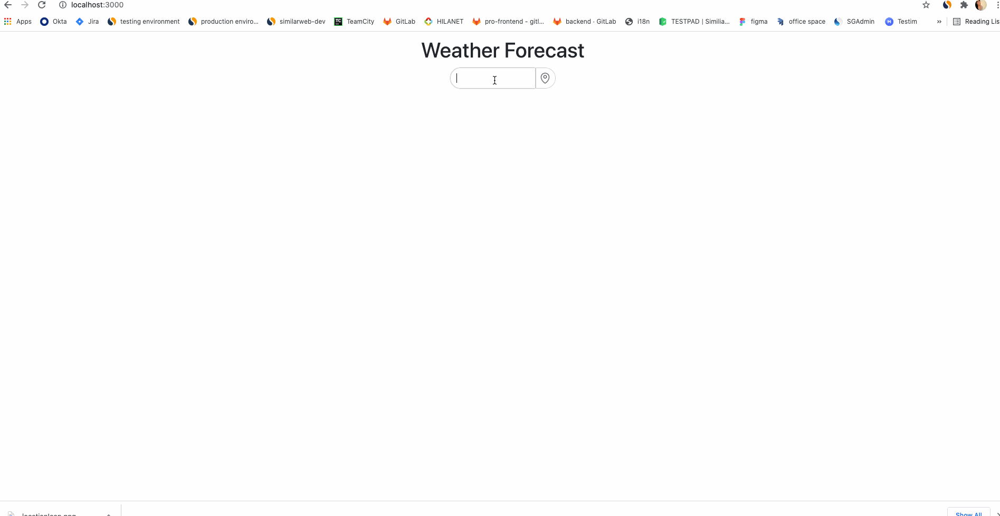

Next steps:

- styling to css files + styled component
- error handleing from API
- multile granularity for chart (daily & hourly)
- typescript for modules
- loading animation after changing location by clicking on the location icon
- table

